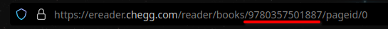

# CheggRipper

> [!CAUTION]
> Downloading books you do not **OWN** is illegal. This tool is **explicitly** only for books you have purchased **to own**.

CheggRipper is a tool to download textbooks from Chegg.

To download a textbook, you must extract your authentication token via cookies. You can do this in a multitude of ways, but the way I recommend is by using `Export cookie JSON for Puppeteer`.

## Setup

- [Firefox Version](https://addons.mozilla.org/en-US/firefox/addon/%E3%82%AF%E3%83%83%E3%82%AD%E3%83%BCjson%E3%83%95%E3%82%A1%E3%82%A4%E3%83%AB%E5%87%BA%E5%8A%9B-for-puppeteer/)
- [Chrome Version](https://chrome.google.com/webstore/detail/%E3%82%AF%E3%83%83%E3%82%AD%E3%83%BCjson%E3%83%95%E3%82%A1%E3%82%A4%E3%83%AB%E5%87%BA%E5%8A%9B-for-puppet/nmckokihipjgplolmcmjakknndddifde)

From there, the cookies **For the current page** will be exported to JSON. Make sure you are on the `ereader.chegg.com` when you use the extension. Save the JSON into the config directory of this repo as `chegg.cookies.json`

> [!WARNING]  
> You should treat cookies exported as you would a plaintext list of passwords. Cookies may (*will* in this case) contain plaintext authentication tokens.

You also need the book ID. This is very simple to get.



Paste the book ID into `config/config.json`. It should look like this:

```json
{
    "BookID": "9780357501887"
}
```
